<picture>
  <source media="(prefers-color-scheme: dark)" srcset="https://raw.githubusercontent.com/Ashish2345/Ashish2345/output/github-snake-dark.svg" />
  <source media="(prefers-color-scheme: light)" srcset="https://raw.githubusercontent.com/Ashish2345/Ashish2345/output/github-snake.svg" />
  
</picture>

---

I'm a full-stack and AI/ML engineer in Kathmandu. Six years building systems other
people depend on — document pipelines, programmable telephony, multi-tenant HR
platforms, CRMs, and asset management for the Government of Nepal. Mostly Python and Go.

Lately the work is document AI: OCR and extraction pipelines, agentic workflows on
LangGraph, and the durable orchestration that keeps a twenty-minute job alive when
step six fails. I care more about what happens on the unhappy path than about the demo.

Currently at Docsumo. On the side I build [Dafa](https://merodafa.com), which tracks
regulatory change across government portals.

 

<b>&nbsp;Systems I've shipped</b> &nbsp;12 across 5 domains

 

| System | Domain | What it does |
| :--- | :--- | :--- |
| [**Dafa**](https://merodafa.com) | Doc AI | Crawls government portals, OCRs bilingual scans, diffs regulation versions, and alerts on what changed |
| **AI-Enabled VOIP** | Telecom | Programmable voice telephony — automated call handling and routing, bulk call and SMS, Nepali-language messaging flows |
| **Omnichannel Communication** | Telecom | One inbox across internal chat, Facebook, and WhatsApp with unified threading |
| **SaaS HRM** | HR | Multi-tenant payroll, attendance, leave, TADA, OKR, and vacancy management, with APIs behind the mobile app |
| **Asset Management** | GovTech | Asset tracking and lifecycle management for the Government of Nepal |
| **CRM** | Sales | Customer and sales pipeline with asset valuation |
| **Waybill** | Logistics | Cargo and courier tracking — shipment lifecycle, route checkpoints, customer status lookup |
| [**Appointly**](https://github.com/Encode-Technologies/appointly) | Scheduling | Appointment booking for dental clinics and salons |
| [**Khatabook**](https://github.com/Ashish2345/khatabook) | Fintech | Digital ledger — credit and debit bookkeeping for small shops |
| **Sync-Up** | Platform | Team sync and collaboration platform |
| **Short-form video app** | Media | Vertical video feed and upload pipeline |
| **Accessibility platform** | Health | A system built for the neuro-divergent community |

<b>&nbsp;Background</b> &nbsp;2020 → now

 

| | Role | Where |
| :--- | :--- | :--- |
| **2025 — now** | Software Engineer | **Docsumo** — document AI |
| **2024 — 2025** | Software Engineer | **Verisk** — form management systems |
| **2022 — 2024** | Python/Django Developer | **PRIXA** — HRM, VOIP, omnichannel, CRM, GovTech |
| **2020 — now** | Python Developer | **Freelance** — booking, delivery, tracking platforms |

**BSc Computer Science** — University of Sunderland via ISMT College, 2024.
Also work in cybersecurity: threat detection and vulnerability assessment.

 

**Stack** — Python · Go · TypeScript · FastAPI · Django · React · LangGraph · Langfuse · PostgreSQL · MongoDB · Redis · Docker · Kubernetes · AWS · GCP · Temporal

**Elsewhere** — [ashish12.com.np](https://ashish12.com.np) · [LinkedIn](https://www.linkedin.com/in/aashish-rayamajhi-a453011ba/) · [merodafa.com](https://merodafa.com)
