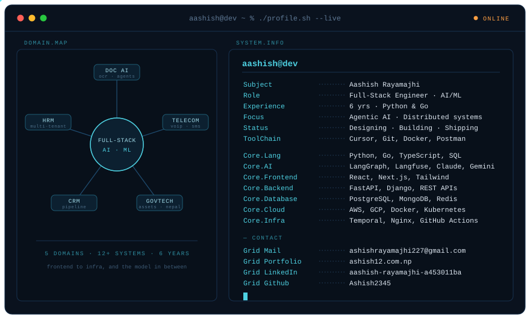

<picture>
  <source media="(prefers-color-scheme: dark)" srcset="https://raw.githubusercontent.com/Ashish2345/Ashish2345/output/github-snake-dark.svg" />
  <source media="(prefers-color-scheme: light)" srcset="https://raw.githubusercontent.com/Ashish2345/Ashish2345/output/github-snake.svg" />
  
</picture>

---

I'm a backend and AI engineer in Kathmandu. Six years building systems other people
depend on — document pipelines, programmable telephony, multi-tenant HR platforms,
CRMs, and asset management for the Government of Nepal. Mostly Python and Go.

Lately the work is document AI: OCR and extraction pipelines, agentic workflows on
LangGraph, and the durable orchestration that keeps a twenty-minute job alive when
step six fails. I care more about what happens on the unhappy path than about the demo.

Currently at Docsumo. On the side I build [Dafa](https://merodafa.com), which tracks
regulatory change across government portals.

**Stack** — Python · Go · FastAPI · Django · LangGraph · Langfuse · PostgreSQL · MongoDB · Redis · Docker · Kubernetes · Temporal

**Elsewhere** — [ashish12.com.np](https://ashish12.com.np) · [LinkedIn](https://www.linkedin.com/in/aashish-rayamajhi-a453011ba/) · [merodafa.com](https://merodafa.com)
