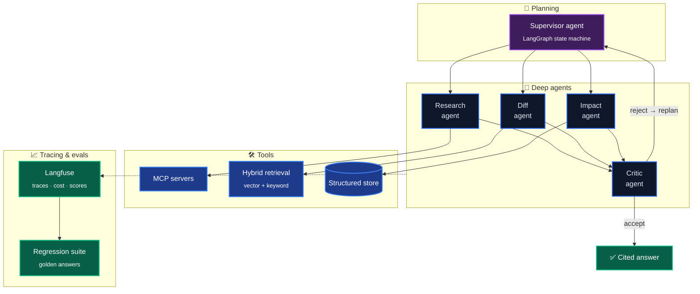

---

## What I do

I build **agentic AI systems for documents** — end-to-end workflows that take
unstructured, scanned, multilingual source material and turn it into structured
data a business can act on.

I have worked on complex document workflows end to end: ingestion, OCR,
normalization, retrieval, LLM reasoning, and the durable orchestration that keeps
a twenty-minute multi-step job alive when step six fails. The model is the easy
part — the engineering is everything around it.

---

## 🚀 [Dafa](https://merodafa.com) · regulatory compliance intelligence

Regulations change constantly, across dozens of government portals, in two
languages, as scanned PDFs. Dafa watches all of it and tells a compliance officer
what changed, what it means for *their* business, and by when.

| Capability | What it means in practice |
|---|---|
| **Daily acquisition** | Scheduled crawl of every major government portal, per country |
| **Bilingual OCR** | Scanned PDFs in mixed-language layouts — the hard case, and the edge |
| **Legal translation** | Translation tuned for legal precision, not readability |
| **Change detection** | Structural diff between old and new versions of a regulation |
| **Classification** | Which industries and company types does this actually affect? |
| **Cross-referencing** | Resolves "this circular modifies Section 47 of Act X" into a real link |
| **Deduplication** | One directive published across five portals collapses to one record |
| **Field extraction** | Effective date, penalty, filing requirement — as structured fields |
| **Impact analysis** | Given a customer's business context, what does this change mean for them? |
| **Alerting** | Compliance officer notified within hours of publication |

---

## How the agent layer works

Compliance answers cannot be one LLM call. A supervisor decomposes the question,
specialist agents work in parallel against real tools, and a critic agent rejects
weak output back to the planner. Every step is traced, scored, and replayable —
if an answer was wrong last Tuesday, I can reproduce exactly why.

**Why it is built this way:** a critic loop catches confident nonsense before a
customer sees it. Tracing makes cost and latency per agent visible instead of
mysterious. And a golden-answer regression suite means a prompt change cannot
silently degrade an answer that used to be right.

---

## Stack

<table align="center">
<tr><td><b>Languages</b></td><td>

</td></tr>
<tr><td><b>Agentic&nbsp;AI</b></td><td>

</td></tr>
<tr><td><b>Models&nbsp;&amp;&nbsp;OCR</b></td><td>

</td></tr>
<tr><td><b>Backend</b></td><td>

</td></tr>
<tr><td><b>Orchestration</b></td><td>

</td></tr>
<tr><td><b>Data</b></td><td>

</td></tr>
<tr><td><b>DevOps</b></td><td>

</td></tr>
<tr><td><b>Observability</b></td><td>

</td></tr>
</table>

---

## Selected work

| Project | What it does |
|---|---|
| 🚀 **[Dafa](https://merodafa.com)** | Regulatory compliance intelligence — crawl, bilingual OCR, change detection, LLM impact analysis, alerting |
| 📦 **Waybill** | Cargo and courier tracking — shipment lifecycle, route checkpoints, live customer status |
| 📞 **AI-Enabled VOIP System** | Programmable calling with automated call handling and routing |
| 💬 **Omnichannel Communication Platform** | One inbox across voice, SMS, and chat with unified threading |
| 👥 **SaaS HRM** | Multi-tenant HR — payroll, attendance, leave, and asset management |
| 📊 **CRM** | Sales and customer pipeline management with asset valuation |
| 📝 **CMS** | Content management with structured publishing workflows |
| 🦷 **[appointly](https://github.com/Encode-Technologies/appointly)** | Appointment booking and scheduling for dental clinics and salons |
| 📒 **[khatabook](https://github.com/Ashish2345/khatabook)** | Digital ledger — credit/debit bookkeeping for small shops |

---

## How I work

- **Durability over cleverness.** If a step can fail, it gets a retry policy and a checkpoint.
- **Evals before vibes.** An agent without a regression suite is a demo, not a product.
- **Explicit beats implicit.** Types and schemas at every boundary; the inside can stay pragmatic.
- **Observable by default.** A system you cannot trace is a system you cannot operate.
- **Reproducible or unfinished.** If it does not come up clean in Docker, it is not done.

Also work in cybersecurity — vulnerability assessment and threat detection.

### Find me

