---

## What I do

I build **AI document extraction systems** — software that reads messy, scanned,
600-page documents and turns them into clean structured data you can search and
trust.

The hard part isn't the model. It's everything around it: OCR that doesn't lose the
layout, indexing that survives a document too big for any context window, and
citations that prove where every answer came from.

```mermaid
flowchart LR
    A["📄 Scanned PDF<br/><sub>600+ pages</sub>"] --> B["🔍 OCR<br/><sub>digital + Vision</sub>"]
    B --> C["📝 Markdown<br/><sub>~800K chars</sub>"]
    C --> D["🧠 LLM Indexing<br/><sub>chunked + merged</sub>"]
    D --> E["🌳 Structured Tree<br/><sub>navigable sections</sub>"]
    E --> F["💬 Plain-language Q&A"]
    F --> G["🎯 Cited Answer<br/><sub>mapped to the exact clause</sub>"]

    classDef inp fill:#1E3A8A,stroke:#3B82F6,stroke-width:2px,color:#fff
    classDef mid fill:#0F172A,stroke:#2563EB,stroke-width:2px,color:#E2E8F0
    classDef out fill:#065F46,stroke:#10B981,stroke-width:2px,color:#fff
    class A inp
    class B,C,D,E mid
    class F,G out
```

<i>The pipeline behind <a href="https://merodafa.com"><b>Dafa</b></a> — my document intelligence product.</i>

---

## Stack

---

## Building now

### 🚀 [Dafa](https://merodafa.com) · document intelligence for law & tax

Statutes go in as scanned PDFs. A navigable index of the act comes out — ask it a
question in plain language, get an answer anchored to the exact clause.

| | |
|---|---|
| **Ingestion** | 600+ page statutes, upload to queryable index |
| **OCR** | Per-page routing — digital text extraction, Google Vision for scans |
| **Indexing** | LLM-built section tree over ~800K characters, chunked and reassembled |
| **Citations** | Every answer mapped back to its region on the source page |

---

## Selected work

| Project | What it does |
|---|---|
| 🚀 **[Dafa](https://merodafa.com)** | AI document extraction for legal & tax — OCR, LLM indexing, clause-level citations |
| 📦 **Waybill** | Cargo and courier tracking — shipment lifecycle, route checkpoints, live customer status |
| 📞 **AI-Enabled VOIP System** | Programmable calling with automated call handling and routing |
| 💬 **Omnichannel Communication Platform** | One inbox across voice, SMS, and chat with unified threading |
| 👥 **SaaS HRM** | Multi-tenant HR — payroll, attendance, leave, and asset management |
| 📊 **CRM** | Sales and customer pipeline management with asset valuation |
| 📝 **CMS** | Content management with structured publishing workflows |
| 🦷 **[appointly](https://github.com/Encode-Technologies/appointly)** | Appointment booking and scheduling for dental clinics and salons |
| 📒 **[khatabook](https://github.com/Ashish2345/khatabook)** | Digital ledger — credit/debit bookkeeping for small shops |

---

## GitHub

---

## How I work

- Boring, explicit code over clever code. Future me is the primary reader.
- Types and schemas at the boundaries; the inside can stay pragmatic.
- If it isn't reproducible in Docker, it isn't done.

Also work in cybersecurity — vulnerability assessment and threat detection.

### Find me

