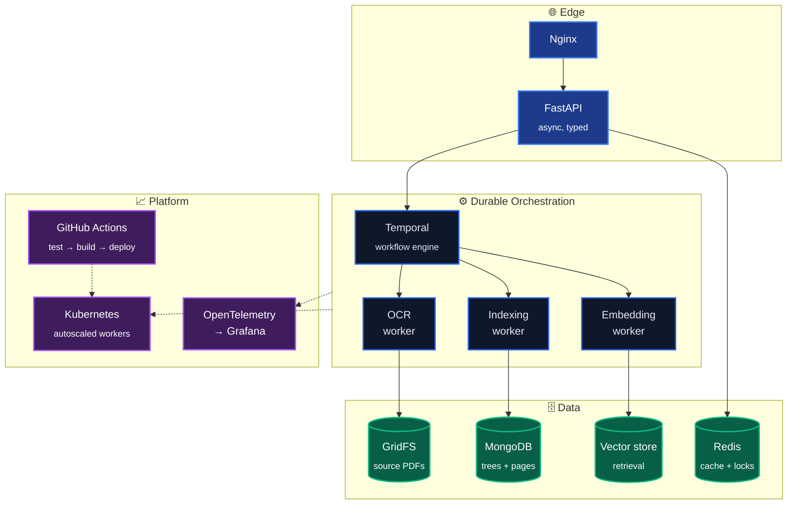

```mermaid
flowchart LR
    A["📄 Scanned PDF<br/><sub>600+ pages</sub>"] --> B["🔍 OCR<br/><sub>digital + Vision</sub>"]
    B --> C["📝 Markdown<br/><sub>~800K chars</sub>"]
    C --> D["🧠 LLM Indexing<br/><sub>chunked + merged</sub>"]
    D --> E["🌳 Structured Tree<br/><sub>navigable sections</sub>"]
    E --> F["💬 Plain-language Q&A"]
    F --> G["🎯 Cited Answer<br/><sub>mapped to the exact clause</sub>"]

    classDef inp fill:#1E3A8A,stroke:#3B82F6,stroke-width:2px,color:#fff
    classDef mid fill:#0F172A,stroke:#2563EB,stroke-width:2px,color:#E2E8F0
    classDef out fill:#065F46,stroke:#10B981,stroke-width:2px,color:#fff
    class A inp
    class B,C,D,E mid
    class F,G out
```

---

## What I do

I build **AI document extraction systems** — software that reads messy, scanned,
600-page documents and turns them into clean structured data you can search and
trust.

The model is the easy part. The engineering is everything around it: OCR that
preserves layout, indexing that survives documents far larger than any context
window, orchestration that resumes instead of restarting, and citations that
prove where every answer came from.

<i>Extraction pipeline behind <a href="https://merodafa.com"><b>Dafa</b></a>.</i>

---

## How it runs

A single ingestion is eight steps and twenty-plus minutes of OCR and LLM calls.
Step six failing must not mean starting over. So the pipeline is **durable, not
merely asynchronous** — every step is an idempotent activity with its own retry
policy and checkpoint, and a worker crash resumes mid-document instead of
re-burning the whole job.

**What that buys:** partial failure costs one activity, not one document.
Backpressure is a queue depth, not a timeout. Replaying a workflow reproduces a
bug exactly.

---

## Stack

<table align="center">
<tr><td><b>Languages</b></td><td>

</td></tr>
<tr><td><b>Backend</b></td><td>

</td></tr>
<tr><td><b>Orchestration</b></td><td>

</td></tr>
<tr><td><b>Data</b></td><td>

</td></tr>
<tr><td><b>AI / ML</b></td><td>

</td></tr>
<tr><td><b>DevOps</b></td><td>

</td></tr>
<tr><td><b>Observability</b></td><td>

</td></tr>
</table>

---

## Building now

### 🚀 [Dafa](https://merodafa.com) · document intelligence for law & tax

Statutes go in as scanned PDFs. A navigable index of the act comes out — ask a
question in plain language, get an answer anchored to the exact clause.

| | |
|---|---|
| **Ingestion** | 600+ page statutes, upload to queryable index, checkpointed per step |
| **OCR** | Per-page routing — digital text extraction, Google Vision for scans |
| **Indexing** | LLM-built section tree over ~800K characters, chunked and reassembled |
| **Citations** | Every answer mapped back to its region on the source page |
| **Ops** | Containerized workers, autoscaled per queue depth, traced end to end |

---

## Selected work

| Project | What it does |
|---|---|
| 🚀 **[Dafa](https://merodafa.com)** | AI document extraction for legal & tax — OCR, LLM indexing, clause-level citations |
| 📦 **Waybill** | Cargo and courier tracking — shipment lifecycle, route checkpoints, live customer status |
| 📞 **AI-Enabled VOIP System** | Programmable calling with automated call handling and routing |
| 💬 **Omnichannel Communication Platform** | One inbox across voice, SMS, and chat with unified threading |
| 👥 **SaaS HRM** | Multi-tenant HR — payroll, attendance, leave, and asset management |
| 📊 **CRM** | Sales and customer pipeline management with asset valuation |
| 📝 **CMS** | Content management with structured publishing workflows |
| 🦷 **[appointly](https://github.com/Encode-Technologies/appointly)** | Appointment booking and scheduling for dental clinics and salons |
| 📒 **[khatabook](https://github.com/Ashish2345/khatabook)** | Digital ledger — credit/debit bookkeeping for small shops |

---

---

## How I work

- **Durability over cleverness.** If a step can fail, it gets a retry policy and a checkpoint.
- **Explicit beats implicit.** Types and schemas at every boundary; the inside can stay pragmatic.
- **Observable by default.** A system you cannot trace is a system you cannot operate.
- **Reproducible or unfinished.** If it does not come up clean in Docker, it is not done.

Also work in cybersecurity — vulnerability assessment and threat detection.

### Find me

